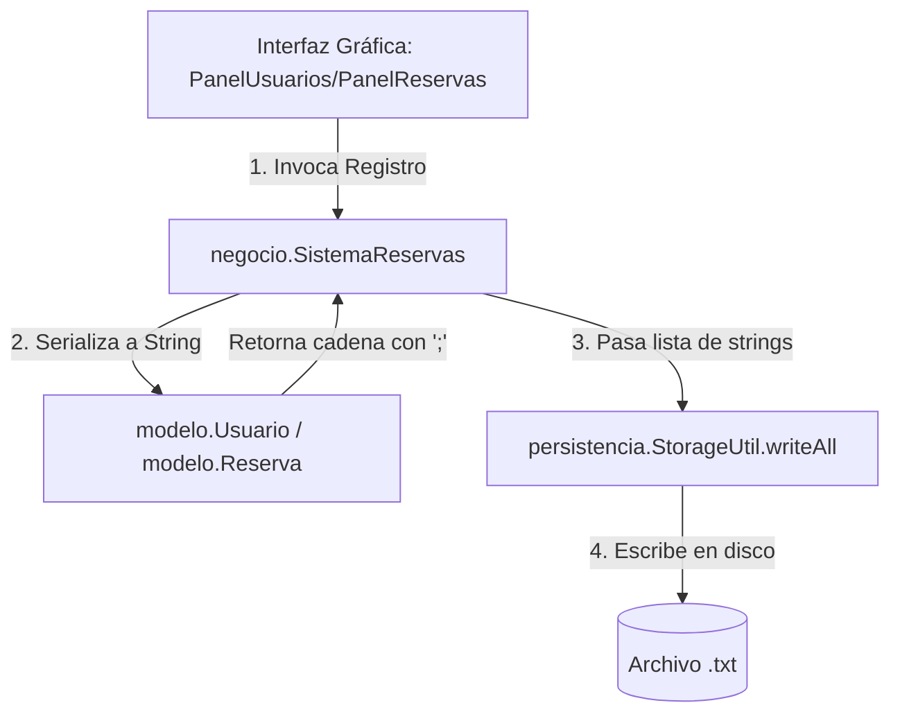
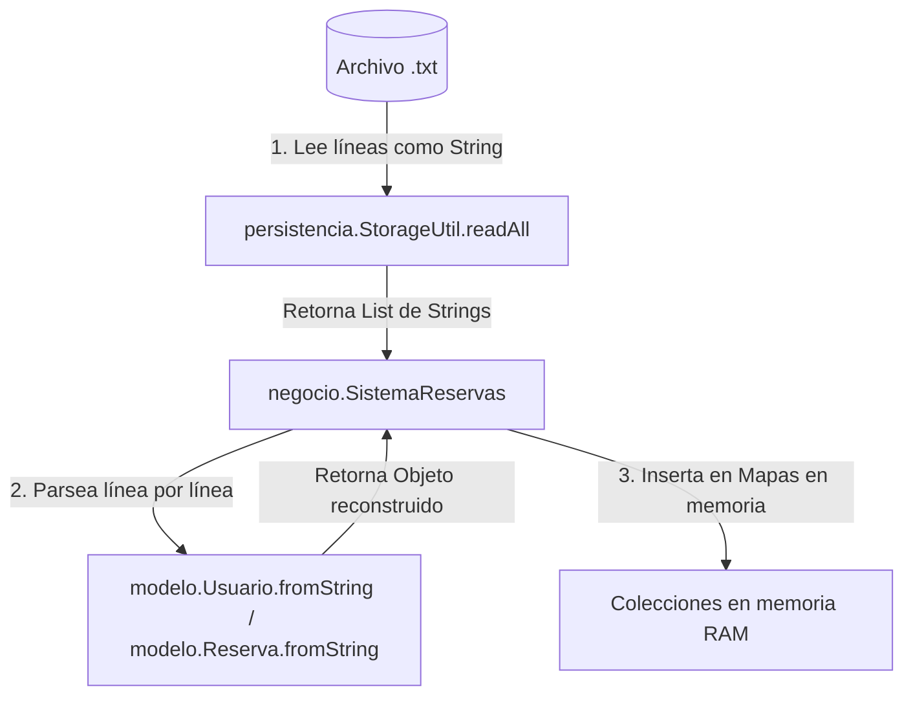

# Guía de Comprensión del Sistema de Reservas de Laboratorios

Este documento explica la estructura, la arquitectura y el funcionamiento detallado del código del **Sistema de Reservas de Laboratorios** desarrollado en Java.

---

## 1. Estructura de Archivos del Proyecto

El código fuente del proyecto se organiza bajo el directorio `src` de la siguiente manera:

```text
src/
├── sistemareservaslaboratorios/
│   └── SistemaReservasLaboratorios.java (Punto de entrada de la aplicación)
├── modelo/
│   ├── Usuario.java                 (Entidad que representa a un usuario)
│   ├── Laboratorio.java             (Entidad que representa a un laboratorio)
│   └── Reserva.java                 (Entidad que representa una reserva agendada)
├── persistencia/
│   └── StorageUtil.java             (Utilidad simple para lectura/escritura de archivos)
├── negocio/
│   └── SistemaReservas.java         (Controlador principal con la lógica del negocio)
└── interfaz/
    ├── VentanaPrincipal.java        (Ventana principal contenedora con navegación de pestañas)
    ├── PanelUsuarios.java           (Formulario y listado de usuarios)
    ├── PanelLaboratorios.java       (Formulario y listado de laboratorios)
    ├── PanelReservas.java           (Gestión, edición y filtrado de reservas)
    ├── SimpleDialog.java            (Cuadro de diálogo de alerta personalizado)
    └── UtilConfirm.java             (Cuadro de diálogo de confirmación personalizado)
```

---

## 2. Flujo de Datos y Persistencia (`persistencia.StorageUtil`)

La persistencia del sistema está basada en **archivos planos de texto** independientes donde cada entidad se almacena en su propio archivo (`usuarios.txt`, `laboratorios.txt` y `reservas.txt`). 

La clase `StorageUtil.java` actúa como la capa de acceso a datos de bajo nivel, abstrayendo las operaciones de entrada/salida (I/O).

### 2.1 Análisis del Código de `StorageUtil.java`
La clase cuenta con dos métodos estáticos que encapsulan el manejo de flujos de archivos:

1.  **`readAll(String path)`**:
    *   Crea una instancia de `File`.
    *   Comprueba si el archivo existe con `!f.exists()`. Si el archivo no existe, retorna una lista vacía de forma segura en lugar de lanzar una excepción `FileNotFoundException`.
    *   Utiliza una sentencia **try-with-resources** para abrir un `BufferedReader` sobre un `FileReader`. Esto garantiza que el flujo de lectura se cierre automáticamente al finalizar, evitando fugas de memoria en el sistema operativo.
    *   Lee el archivo línea por línea usando `r.readLine()` hasta llegar al final del archivo (`null`), agregando cada línea a una lista de cadenas (`List<String>`).
2.  **`writeAll(String path, List<String> lines)`**:
    *   Abre un `PrintWriter` sobre un `FileWriter` utilizando la sentencia **try-with-resources** para el cierre automático del flujo de escritura.
    *   Itera por la lista de líneas (`lines`) recibida y escribe cada elemento como una línea independiente usando `w.println(l)`.
    *   Sobrescribe por completo el archivo seleccionado con los datos actuales cada vez que es invocado.

---

### 2.2 Ciclo de Aplicación de la Persistencia
La persistencia no se ejecuta directamente en la interfaz gráfica, sino que sigue un flujo estructurado a través de las capas del sistema:

#### A. Flujo de Guardado (De Objetos a Texto)
Cuando ocurre un cambio en el sistema (por ejemplo, registrar un usuario o crear una reserva):

1.  **Mutación:** El usuario interactúa con los paneles de la interfaz gráfica y presiona un botón (ej: "Registrar").
2.  **Lógica:** El panel envía los datos capturados al controlador `SistemaReservas`.
3.  **Serialización:** El controlador toma el objeto del modelo y extrae su representación en texto plano invocando su método `toString()`. Este método une las propiedades de la entidad usando un delimitador (punto y coma `;`).
    *   *Ejemplo de salida de `Reserva.toString()`:* `uuid-1234;12.345.678-9;LAB-A1;2026-06-17;Bloque 1;Clase de Redes`
4.  **Escritura:** El controlador recopila las cadenas de todas las entidades activas en memoria, las empaqueta en una lista y se las entrega a `StorageUtil.writeAll()`, la cual escribe la lista sobre el archivo de texto correspondiente.

#### B. Flujo de Carga (De Texto a Objetos)
Al iniciar la aplicación o refrescar los datos:

1.  **Lectura:** Al arrancar, el constructor de `VentanaPrincipal` invoca a `sistema.cargarDatos()`. Este método llama a `StorageUtil.readAll()`.
2.  **Procesamiento:** `StorageUtil` retorna todas las líneas encontradas en el archivo físico.
3.  **Reconstrucción (Deserialización):** El controlador recorre cada línea de texto y llama al método estático `fromString(line)` de la clase modelo correspondiente.
    *   El método `fromString` fragmenta la línea usando `.split(";", -1)`.
    *   Asigna cada fragmento a su respectivo atributo del constructor del objeto.
4.  **Carga:** El objeto reconstruido es guardado en memoria RAM dentro de mapas asociativos (`Map`) utilizando la clave única (RUT para usuarios, código para laboratorios e ID para reservas).

---

## 3. Explicación del Modelo de Datos (Clases Modelo)

Las clases dentro del paquete `modelo` representan el núcleo de datos del dominio y la estructura de la base de datos basada en archivos planos.

### 3.1 Clase `Usuario.java`
Representa a las personas autorizadas para reservar laboratorios (estudiantes, académicos o funcionarios).
*   **Atributos:**
    *   `rut` (`String`): Clave primaria lógica/identificador único del usuario (por ejemplo, `12.345.678-9`).
    *   `nombre` (`String`): Nombre completo del usuario.
    *   `tipo` (`String`): Clasificación del usuario (valores sugeridos: `estudiante`, `académico` o `funcionario`).
    *   `correo` (`String`): Dirección de correo electrónico de contacto.
*   **Constructor:** Inicializa todos los atributos mediante asignaciones directas en una sola línea.
*   **Métodos Clave:**
    *   `toString()`: Serializa el usuario a formato CSV usando `;` como separador: `rut;nombre;tipo;correo`.
    *   `fromString(String line)`: Separa la cadena utilizando `;`. Utiliza operadores ternarios para asignar valores por defecto en caso de que alguna columna falte en el archivo de texto (evitando excepciones `ArrayIndexOutOfBoundsException`).

---

### 3.2 Clase `Laboratorio.java`
Representa la entidad física del laboratorio disponible para ser agendado.
*   **Atributos:**
    *   `codigo` (`String`): Identificador único del laboratorio (por ejemplo, `LAB-A1`).
    *   `nombre` (`String`): Nombre descriptivo (ej. *Laboratorio de Computación Avanzada*).
    *   `capacidad` (`int`): Cantidad máxima de personas permitidas (debe ser un valor entero positivo).
    *   `ubicacion` (`String`): Lugar físico del laboratorio (ej. *Piso 2, Edificio B*).
    *   `equipamiento` (`String`): Descripción de los elementos técnicos disponibles (ej. *20 PCs, Proyector*).
*   **Constructor:** Inicializa la entidad con los parámetros pasados.
*   **Métodos Clave:**
    *   `toString()`: Serializa el laboratorio a texto plano: `codigo;nombre;capacidad;ubicacion;equipamiento`.
    *   `fromString(String line)`: Parsea la línea de texto. Verifica si el campo `capacidad` no está vacío antes de usar `Integer.parseInt(p[2])` para prevenir fallos al deserializar datos corruptos o incompletos.

---

### 3.3 Clase `Reserva.java`
Modela el agendamiento de un laboratorio por parte de un usuario para una fecha y bloque de horario determinado.
*   **Atributos:**
    *   `id` (`String`): Identificador único universal (UUID) generado al crear la reserva para diferenciarla de las demás.
    *   `rutUsuario` (`String`): El RUT del usuario que realiza el agendamiento (Llave foránea hacia `Usuario`).
    *   `codigoLab` (`String`): El código del laboratorio reservado (Llave foránea hacia `Laboratorio`).
    *   `fecha` (`String`): La fecha de la reserva en formato `yyyy-MM-dd`.
    *   `bloque` (`String`): Bloque de horario específico (por ejemplo, `Bloque 1 (08:30 - 10:00)`).
    *   `motivo` (`String`): Justificación o descripción del uso que se le dará al laboratorio.
*   **Constructor:** Asigna todos los campos de información del agendamiento.
*   **Métodos Clave:**
    *   `toString()`: Formatea los datos a una línea de texto plano: `id;rutUsuario;codigoLab;fecha;bloque;motivo`.
    *   `fromString(String line)`: Separa las partes mediante `;` y regenera la instancia completa de la reserva.

---

## 4. Contexto y Análisis Detallado del Controlador de Negocio (`negocio.SistemaReservas`)

La clase `SistemaReservas` es el **componente central del sistema**. Actúa como el controlador de la aplicación, manteniendo el estado de los datos en memoria RAM y gestionando las transacciones de lectura/escritura hacia los archivos de texto.

### 4.1 Estructuras de Datos y Estado en Memoria
El controlador utiliza mapas en lugar de listas para agilizar las búsquedas por clave primaria y evitar registros duplicados redundantes:
*   `usuarios` (`Map<String, Usuario>`): Implementado como un `LinkedHashMap` para preservar el orden cronológico en el que se registraron los usuarios. Su clave es el `RUT`.
*   `labs` (`Map<String, Laboratorio>`): Implementado como un `HashMap` básico. Su clave es el `código` único del laboratorio.
*   `reservas` (`Map<String, Reserva>`): Implementado como un `LinkedHashMap` para mantener el orden en que fueron agendadas. Su clave es el `ID` de la reserva (un UUID).

---

### 4.2 Carga y Persistencia de Datos
*   **`cargarDatos()`**:
    *   Limpia las colecciones en memoria llamando a `.clear()`.
    *   Lee todas las líneas de `usuarios.txt`, `laboratorios.txt` y `reservas.txt`.
    *   Parsea cada línea y la inserta en los mapas correspondientes.
    *   Cada proceso de conversión está envuelto en un bloque `try-catch` independiente para que las líneas que contengan errores o formatos corruptos sean omitidas en silencio sin interrumpir la carga del resto de los datos válidos.
*   **`guardarDatos()`**:
    *   Convierte las colecciones de objetos en memoria en listas de cadenas de texto llamando a la función `.toString()` de cada elemento usando flujos de Java (`streams` y `.collect(Collectors.toList())`).
    *   Escribe recursivamente los datos frescos en los tres archivos planos sobrescribiendo su contenido anterior de forma automática.

---

### 4.3 Gestión de Registros Básicos (Usuarios y Laboratorios)
*   **`registrarUsuario(Usuario u)`**:
    *   Valida que el objeto no sea nulo y que el RUT no esté en blanco.
    *   Verifica si el usuario ya existe en el mapa usando `usuarios.containsKey(u.getRut())`. Si existe, retorna `false` impidiendo el registro duplicado.
    *   Si pasa las validaciones, agrega al usuario y realiza un guardado inmediato (`guardarDatos()`) en disco para evitar pérdida de datos si la aplicación se cierra inesperadamente.
*   **`registrarLaboratorio(Laboratorio l)`**:
    *   Funciona bajo el mismo estándar de validación de campos vacíos y llaves duplicadas que el registro de usuarios. Al registrar con éxito, invoca automáticamente a `guardarDatos()`.

---

### 4.4 Lógica Crítica de Reservas
*   **`intentarCrearReserva(Reserva r)`**:
    Este método contiene la validación de reglas de negocio más estricta del sistema y retorna un mensaje de texto explicativo si la reserva es denegada:
    1.  **Campos vacíos:** Revisa que el RUT, código de laboratorio, fecha y bloque no estén vacíos.
    2.  **Validación de existencia:** Corrobora que el `rutUsuario` exista en el mapa `usuarios` y que el `codigoLab` exista en `labs`. De lo contrario, rechaza la solicitud.
    3.  **Formato de fecha:** Valida la estructura de la fecha llamando a `LocalDate.parse(fecha)`. Si el formato no es `yyyy-MM-dd` o la fecha es inválida (ej. *30 de febrero*), atrapa la excepción y retorna un mensaje de error explicativo.
    4.  **Verificación de Choque de Horarios (Solapamiento):**
        ```java
        for (Reserva ex : reservas.values()) {
            if (ex.getCodigoLab().equals(lab) && ex.getFecha().equals(fecha) && ex.getBloque().equals(bloque)) {
                return "Conflicto: ya existe una reserva...";
            }
        }
        ```
        Recorre todas las reservas almacenadas. Si coincide el laboratorio, la fecha y el bloque de horario, se retorna un mensaje de conflicto y no se almacena la reserva.
    5.  Si supera todas las pruebas, se añade a la base de datos y se guarda en el archivo.
*   **`modificarReserva(String id, String nuevaFecha, String nuevoBloque, String nuevoMotivo)`**:
    *   Recupera la reserva correspondiente mediante el `ID`.
    *   Verifica que la nueva combinación de fecha y bloque no colisione con otra reserva del mismo laboratorio, **excluyendo a la reserva que se está modificando** para permitir cambios menores (como modificar solo el motivo sin alterar el bloque sin generar falsas colisiones consigo misma).
    *   Genera un nuevo objeto `Reserva` modificado, lo inserta en el mapa reemplazando la entrada previa y persiste los cambios.

---

### 4.5 Funciones Especiales de Administración de Consistencia
*   **`eliminarUsuariosDuplicados()`**:
    Reconstruye el mapa de usuarios insertando solo la primera ocurrencia de cada RUT encontrado. Cuenta cuántos registros duplicados fueron descartados y los remueve del mapa principal.
*   **`eliminarReservasHuerfanas()`**:
    Recorre las reservas y detecta aquellas que hagan referencia a un `rutUsuario` que no se encuentre en el mapa de usuarios actual (un escenario común si se eliminaron usuarios manualmente del archivo de texto). Elimina estas reservas para mantener la integridad referencial.
*   **`limpiarDuplicadosYHuerfanos()`**:
    Orquesta los dos métodos de limpieza anteriores, escribe el estado consistente en disco y devuelve un reporte detallado con el número de elementos purgados del sistema.
*   **`backupDatos(String prefix)`**:
    Crea archivos de respaldo con los nombres `<prefix>_usuarios.txt`, `<prefix>_laboratorios.txt` y `<prefix>_reservas.txt`. Esto se ejecuta automáticamente antes de procesos de limpieza masiva para asegurar una opción de recuperación de datos.

---

## 5. Análisis Detallado de Paneles y Diálogos de Interfaz (`interfaz/*`)

El paquete `interfaz` contiene la capa visual, la cual utiliza componentes nativos de **Java AWT**. A continuación se analiza el propósito y comportamiento de cada componente e interacción:

### 5.1 `PanelUsuarios.java`
*   **Propósito:** Provee el formulario para ingresar nuevos usuarios y visualizar los ya existentes.
*   **Diseño Visual:** Utiliza un contenedor principal en `BorderLayout`. La parte superior (`NORTH`) alberga el formulario utilizando un `GridBagLayout` para alinear de forma simétrica las etiquetas (`Label`), los campos de texto (`TextField`) y el selector desplegable (`Choice`) del tipo de usuario. La parte central (`CENTER`) contiene un área de texto de solo lectura (`TextArea`) donde se listan los usuarios en texto legible.
*   **Lógica Destacada:** 
    *   **Navegación Ascendente en el Árbol de Componentes:** Al registrar exitosamente un usuario, el panel actualiza su propia vista e invoca dinámicamente un refresco de las listas desplegables de reservas en el panel vecino. Dado que no hay un gestor de eventos global o inyección directa, realiza una búsqueda ascendente en la jerarquía visual de Java:
        ```java
        Component parent = getParent();
        while (parent != null && !(parent instanceof VentanaPrincipal)) {
            parent = parent.getParent();
        }
        if (parent != null) {
            ((VentanaPrincipal) parent).refrescarCombosDeReservas();
        }
        ```
        Esto le permite notificar a la ventana contenedora principal para que actualice la información de los combobox en tiempo real.

---

### 5.2 `PanelLaboratorios.java`
*   **Propósito:** Gestiona el ingreso físico de los laboratorios disponibles en el campus.
*   **Estructura:** Sigue la misma estructura arquitectónica y visual que el panel de usuarios (Formulario en `GridBagLayout` al norte, listado formateado en un `TextArea` al centro).
*   **Lógica Destacada:**
    *   **Validaciones en Caliente:** Antes de registrar el laboratorio, se intercepta la entrada del campo `capacidad` (`tfCapacidad`). Valida que el texto sea numérico aplicando un bloque `try-catch` con `Integer.parseInt()`. Posteriormente, se comprueba que el valor sea estrictamente mayor que cero (`capacidad <= 0`), impidiendo registros inválidos.
    *   Al igual que el panel de usuarios, ejecuta el recorrido jerárquico ascendente para actualizar la lista desplegable de laboratorios disponibles en el panel de reservas.

---

### 5.3 `PanelReservas.java`
*   **Propósito:** Agendar, modificar, eliminar y filtrar las reservas de laboratorios. Es el panel más complejo del sistema.
*   **Organización Visual:**
    *   **Oeste (`WEST`):** Formulario de agendamiento y botones de acción ("Agendar", "Modificar", "Eliminar", "Refrescar", "Limpiar") organizados con un subpanel en `FlowLayout`.
    *   **Centro (`CENTER`):** Sección de filtros de búsqueda (por Laboratorio, Fecha o RUT) y la lista interactiva de reservas (`java.awt.List`).
*   **Lógica e Interacciones Clave:**
    *   **Mapeo de Índices:** El control `java.awt.List` nativo de AWT solo maneja textos (`String`). Para poder modificar o eliminar una reserva, la clase mantiene una lista interna paralela llamada `reservasMostradas`. Cuando el usuario hace clic en un elemento de la lista, el evento `ItemListener` recupera el índice seleccionado con `.getSelectedIndex()` y busca el objeto `Reserva` real en la lista en la misma posición, extrayendo el ID único de la reserva.
    *   **Precargado de Formulario:** Al seleccionar una reserva de la lista, los campos del formulario se auto-completan con los datos de dicha reserva para permitir una edición rápida. Los selectores de RUT y Laboratorio buscan la opción que comience con el código/RUT correspondiente (`startsWith(...)`) y la seleccionan automáticamente.
    *   **Búsqueda y Filtrado Dinámico:** El método `refrescarListado()` evalúa la selección de `choiceFiltro` y el valor de búsqueda escrito en `tfFiltro` para comparar de forma no sensible a mayúsculas (`.toLowerCase().contains()`) y repoblar la lista en pantalla únicamente con las coincidencias.

---

### 5.4 `SimpleDialog.java`
*   **Propósito:** Desplegar mensajes de advertencia o confirmación simples de forma modal (bloqueante).
*   **Contexto:** En AWT no existe la clase de Swing `JOptionPane.showMessageDialog()`. Por lo tanto, esta clase crea manualmente una ventana modal temporal instanciando un `Frame` auxiliar invisible, un componente `Dialog` modal (`true`) centrado en pantalla, una etiqueta con el mensaje y un botón "OK" que al presionarse destruye (`dispose()`) tanto el diálogo como el marco contenedor.

---

### 5.5 `UtilConfirm.java`
*   **Propósito:** Desplegar mensajes de confirmación de doble paso (acciones de riesgo como eliminar datos).
*   **Implementación:** Similar a `SimpleDialog`, pero añade dos botones ("Sí" y "No").
*   **Traspaso de Estados:** Para capturar la respuesta del usuario dentro de los hilos de los escuchadores de eventos (`ActionListener`), define una variable final estructurada en arreglo de tamaño uno: `final boolean[] res = {false}`. Al hacer clic en "Sí", se asigna `true` al primer elemento y se cierra el diálogo modal. El método bloquea el hilo principal mientras el diálogo sea visible y retorna el valor lógico una vez que el diálogo se destruye.

---

## 6. Explicación Línea por Línea de `VentanaPrincipal.java`

Esta clase extiende de `java.awt.Frame` y representa la ventana principal de la aplicación, implementando una barra de navegación superior con diseño de vistas intercambiables (**CardLayout**).

| Línea(s) | Código | Explicación |
| :--- | :--- | :--- |
| **1** | `package interfaz;` | Indica que pertenece al espacio de nombres de la interfaz de usuario. |
| **3 - 5** | *Imports* | Importa librerías gráficas de AWT y la lógica de negocio (`negocio.SistemaReservas`). |
| **7** | `public class VentanaPrincipal extends Frame` | Define la clase extendiendo `Frame` para que sea una ventana nativa de escritorio. |
| **8 - 11** | *Atributos privados* | Declara la lógica de negocio (`sistema`) y los tres paneles internos (`panelUsuarios`, `panelLaboratorios`, `panelReservas`). |
| **13** | `public VentanaPrincipal()` | Constructor de la clase VentanaPrincipal. |
| **14** | `super("Sistema Reservas");` | Asigna el título `"Sistema Reservas"` a la ventana. |
| **15 - 17** | *Carga de Datos* | Instancia el sistema de reservas, lee los archivos de texto planos de disco y depura la carga por consola. |
| **19** | `setLayout(new BorderLayout(8,8));` | Utiliza un diseño de tipo `BorderLayout` con un espaciado horizontal y vertical de 8 píxeles. |
| **21 - 32** | *MenuBar y Menú de Archivo* | Instancia la barra superior de menús, configurando las opciones de limpieza general, limpieza de duplicados y salida segura del sistema. |
| **34 - 36** | `Panel navPanel = new Panel(...)` | Crea la barra de navegación superior utilizando `FlowLayout` y le da un color de fondo gris claro para diferenciarla del contenido. |
| **38 - 40** | *Botones de Navegación* | Declara los tres botones que representarán las pestañas: `"Reservas"`, `"Usuarios"` y `"Laboratorios"`. |
| **42 - 50** | *Estilos y Tamaños de Botones* | Asigna una tipografía de texto en negrita y un tamaño uniforme de `150 x 32` píxeles para mejorar la legibilidad y la facilidad de clic. |
| **52 - 55** | `navPanel.add(...); add(navPanel, BorderLayout.NORTH);` | Rellena la barra con los botones y la fija en el borde superior (`NORTH`) de la ventana. |
| **58 - 60** | *Instanciación de paneles* | Inicializa los tres paneles internos pasándoles la referencia común del backend `sistema`. |
| **63 - 64** | `CardLayout cl = new CardLayout(); Panel container = ...` | Instancia el contenedor principal `container` gobernado por un `CardLayout`. Este gestor de diseño permite apilar múltiples paneles y mostrar solo uno a la vez. |
| **65 - 68** | `container.add(...); add(container, BorderLayout.CENTER);` | Agrega los tres paneles vinculándoles un nombre de pestaña único (`"Reservas"`, `"Usuarios"`, `"Laboratorios"`) e inserta el contenedor en el centro. |
| **71 - 82** | `btnNav....addActionListener(...)` | Configura los escuchadores de clic para cada botón de la barra de navegación. Al hacer clic en un botón, le pide al `CardLayout` que muestre la tarjeta correspondiente y llama a `setButtonActive` para iluminar el botón clickeado en azul metálico y regresar los otros a su color gris habitual. |
| **85 - 86** | *Vista por Defecto* | Programa que al iniciar la aplicación se despliegue inmediatamente la pestaña de `"Reservas"`, marcando su botón como activo. |
| **89 - 119** | *Manejadores de Eventos y Menús* | Configura los atajos del menú ("Limpiar", "Limpiar Duplicados", "Salir") y el escuchador de cierre físico de ventana (`windowClosing`), garantizando que siempre se invoque a `sistema.guardarDatos()` para asegurar la integridad de los archivos de texto antes del apagado. |
| **122 - 123** | `setSize(760, 500); setLocationRelativeTo(null);` | Ajusta el tamaño de la ventana a `760 x 500` (un tamaño más compacto y proporcionado que el original ya que no requiere mostrar paneles en paralelo) y la centra en la pantalla. |
| **126 - 133** | `setButtonActive(Button activeBtn, Button... inactiveBtns)` | Método auxiliar que cambia dinámicamente el color de fondo a Steel Blue (`new Color(70, 130, 180)`) y el texto a blanco para la pestaña seleccionada, mientras que devuelve las demás pestañas inactivas a gris claro y letras negras. |
| **135 - 139** | `refrescarCombosDeReservas()` | Recibe llamados desde otros paneles (usuarios/laboratorios) para actualizar los combobox del panel de reservas. |
| **142 - 147** | `main(String[] args)` | Método principal que arranca la ventana en el hilo de procesamiento gráfico adecuado (`EventQueue.invokeLater`). |

---

## 7. Diseño y Componentes AWT

Dado que el programa está estructurado en base a **Java AWT** (en lugar de Swing), los componentes tienen características específicas:
1.  **`Choice`**: Representa listas desplegables (comboboxes). En `PanelReservas`, se rellenan dinámicamente al presionar refrescar o registrar nuevos elementos.
2.  **`java.awt.List`**: Una lista vertical interactiva de selección única que permite enlazar eventos al seleccionar una reserva (se capturan a través de un `ItemListener` para precargar los datos de la reserva en el formulario para modificarlos o eliminarlos).
3.  **`TextArea`** y **`TextField`**: Para la entrada y visualización de textos multilinea y monolinea respectivamente.
